# AI-Assisted Development Workflow with OpenSpec

## Overview
This workflow describes the process for implementing new features or fixes on existing projects using AI assistance, structured planning, and iterative refinement. It integrates **OpenSpec**, a Spec-Driven Development (SDD) framework designed specifically for AI coding assistants, to align human intent with AI execution before any code is written.

## Workflow Diagram

```mermaid
flowchart TD
    Start([🚀 New Feature or Fix]) 
    
    subgraph Setup["Phase 0️⃣ : Setup"]
        Init["openspec init"]
    end
    
    subgraph Planning["Phase 1️⃣ : Exploration & Proposal"]
        Explore["/opsx:explore<br/>(Investigate Codebase)"]
        NewChange["/opsx:new <feature><br/>(Create Change Folder)"]
        Proposal["Generate proposal.md & specs/"]
        Explore -.-> NewChange
        NewChange --> Proposal
    end
    
    subgraph Refinement["Phase 2️⃣ : Design & Tasks"]
        FastForward["/opsx:ff<br/>(Fast-Forward Artifacts)"]
        Design["Generate design.md"]
        Tasks["Generate tasks.md<br/>(Micro-Tasks ≤2min)"]
        FastForward --> Design
        Design --> Tasks
    end
    
    subgraph Review["Phase 3️⃣ : Human Review"]
        HumanReview{"👤 Review Artifacts<br/>(proposal, specs, design, tasks)"}
        Feedback["❌ Edit Markdown Files"]
    end
    
    subgraph Execution["Phase 4️⃣ : Execution & Verification"]
        Apply["/opsx:apply<br/>(Execute Tasks & TDD)"]
        Verify["/opsx:verify<br/>(Audit against Specs)"]
        Archive["/opsx:archive<br/>(Merge Specs & Archive)"]
        
        Apply --> Verify
        Verify --> Archive
    end
    
    Start --> Setup
    Setup --> Planning
    Planning --> Refinement
    Refinement --> Review
    HumanReview -->|✅ Approved| Execution
    HumanReview -->|❌ Rejected| Feedback
    Feedback -->|Loop back| Refinement
    Archive --> Complete([✨ Complete])
    
    style Setup fill:#f0f4c3
    style Planning fill:#e1f5ff
    style Refinement fill:#f3e5f5
    style Review fill:#fff3e0
    style Execution fill:#fce4ec
```



## Installation & Configuration

Before starting, ensure OpenSpec is installed and initialized in your project.

1. **Install OpenSpec globally** (requires Node.js 20.19.0+):
   ```bash
   npm install -g @fission-ai/openspec@latest
   # or using pnpm, yarn, bun
   ```
2. **Initialize in your project**:
   ```bash
   cd your-project-directory
   openspec init
   ```
   This creates the `openspec/` directory structure (`specs/`, `changes/`, etc.).

## Workflow Phases

### Phase 1: Exploration & Proposal
- **Purpose**: Clarify requirements, investigate the codebase, and establish the behavioral contract.
- **Commands**: `/opsx:explore`, `/opsx:new <feature-name>`
- **Artifacts Generated**: `proposal.md` (intent and scope), `specs/` (Given/When/Then scenarios).
- **Models**: Opus 4.5, Haiku 4.5
- **Self-Contained Prompt**:
  > "Act as an expert software architect. I want to build [Feature/Fix]. First, use `/opsx:explore` to investigate the codebase and ask me clarifying questions. Once we have enough context, use `/opsx:new [feature-name]` to create a new change folder and generate the `proposal.md` and `specs/` to establish the behavioral contract."

### Phase 2: Design & Tasks (Refinement)
- **Purpose**: Convert the proposal and specs into a technical design and concrete, measurable micro-tasks.
- **Commands**: `/opsx:ff` (Fast-forward) or `/opsx:continue`
- **Artifacts Generated**: `design.md` (technical approach), `tasks.md` (implementation checklist).
- **Breakdown**: Each task in `tasks.md` targets ~2 minutes of work.
- **Skills**: Breakdown-task-specialist, TDD, Feature Flag, Gradual Rollout
- **Self-Contained Prompt**:
  > "Now that the proposal and specs are approved, use `/opsx:ff` to generate the `design.md` and `tasks.md`. In the `tasks.md`, refine the work into concrete micro-tasks (≤2 minutes of work each). For each task, explicitly list new/updated/deleted business rules, acceptance criteria, dependencies, required tests, expected failing tests (to maintain TDD boundaries), relevant file/directory references, and suggested skills to use."
- **Adding Skills to the Prompt**:
  > "Please use the following skills to guide your refinement: [List Skills, e.g., Breakdown-task-specialist, TDD]. Apply their principles to ensure the micro-tasks are properly scoped and testable."

### Phase 3: Human Review
- **Purpose**: Validate the OpenSpec artifacts before any code is written.
- **Review Focus**: Check `proposal.md` for scope, `specs/` for business rules, `design.md` for architecture, and `tasks.md` for task sizing.
- **Feedback**: Edit the markdown files directly if adjustments are needed. The AI treats these files as the absolute source of truth.
- **Self-Contained Prompt**:
  > "Please review the generated artifacts in the `openspec/changes/[feature-name]/` folder. Check specifically if the identified business rules in the specs are accurate and if the micro-tasks in `tasks.md` are appropriately sized. Reply with 'Approved' to proceed to execution, or edit the markdown files directly to provide feedback."

### Phase 4: Execution & Verification (Agent-driven)
- **Purpose**: Execute the micro-tasks, verify against specs, and finalize the change.
- **Commands**: `/opsx:apply`, `/opsx:verify`, `/opsx:archive`
- **Implementation**: The AI reads `tasks.md`, writes code (following TDD and feature flags), and physically checks off the markdown checkboxes (`[x]`).
- **Verification**: The AI audits its own work against the `specs/` and `design.md`.
- **Self-Contained Prompt**:
  > "We are now in the Execution phase. Run `/opsx:apply` to start implementing the tasks in `tasks.md`. Follow TDD (write failing tests first, then pass them) and use feature flags if applicable. Check off tasks as they are completed. Once all tasks are done, run `/opsx:verify` to audit the implementation against the specs. Do not run `/opsx:archive` until I approve the verification results."

## Key Principles

1. **Spec-Driven Development (SDD)**: Align human intent with AI execution *before* writing code.
2. **Artifact-Guided Workflow**: Use structured documents (`proposal`, `specs`, `design`, `tasks`) to guide the AI.
3. **Delta Specs**: Focus only on what is changing (`ADDED`, `MODIFIED`, `REMOVED`) relative to the current system, rather than rewriting entire system specs.
4. **Micro-Task Decomposition**: Break work into small, completable units (≤2 min each) in the `tasks.md`.
5. **Human-in-the-Loop Review**: Always validate the OpenSpec artifacts before execution.
6. **Test-First Implementation**: Ensure quality with TDD methodology.

## OpenSpec Artifacts Format

When a new change is created (`/opsx:new`), OpenSpec generates an isolated folder (e.g., `openspec/changes/add-auth/`) containing:

### 1. `proposal.md`
The "why" and "what". Defines the intent, scope, and out-of-scope items.

### 2. `specs/`
The behavior contract. Uses RFC 2119 keywords (MUST, SHALL, SHOULD) and structured Given/When/Then scenarios.

### 3. `design.md`
The "how". Details the technical approach, architecture decisions, and data models.

### 4. `tasks.md` (Detailed Plan Format)
The implementation checklist. Tasks should follow this detailed schema:

```markdown
## Implementation Tasks

### [ ] Task 1: [Title]
- **Est. Time**: ~2min
- **File/Directory References**: [List relevant files/directories, e.g., `src/auth.ts`, `tests/auth/`]
- **Suggested Skills**: [List skills to use, e.g., `TDD`, `mermaid-diagrams`]
- **Business Rules**
  - New: [Describe new business rules]
  - Updated: [Describe changed business logic]
  - Deleted: [Describe removed business logic]
- **Acceptance Criteria**
  - [ ] Criterion 1
  - [ ] Criterion 2
- **Dependencies**: None
- **Tests Required**
  - Unit test: [describe what to test]
- **Expected Failing Tests**: [List tests that should remain failing during this task to maintain TDD boundaries]

### [ ] Task 2: [Title]
- **Est. Time**: ~2min
...
```

## Session Persistence

Between sessions, context is maintained via the OpenSpec directory structure:
- **Active Changes**: Stored in `openspec/changes/<feature-name>/`.
- **Completed Changes**: Merged into the main `openspec/specs/` directory and moved to `openspec/archive/` via the `/opsx:archive` command.

## AI Models Used

- **Opus 4.5**: Complex planning, refinement, and design generation.
- **Haiku 4.5**: Task execution, quick implementations, and test writing.
- **Sonnet 4**: Feature flag implementation and verification.
- **GPT 4o**: Advanced testing scenarios.

## When to Use This Workflow

✅ **Use for:**
- New features on existing projects
- Bug fixes requiring planning
- Refactoring initiatives
- Complex feature implementations

❌ **Skip when:**
- Trivial one-liner fixes
- Well-understood, routine tasks
- Emergency hotfixes (though consider adding context after)

## References

- [OpenSpec Getting Started](https://github.com/Fission-AI/OpenSpec/blob/main/docs/getting-started.md)
- [OpenSpec Installation](https://github.com/Fission-AI/OpenSpec/blob/main/docs/installation.md)
- [OpenSpec Workflows](https://github.com/Fission-AI/OpenSpec/blob/main/docs/workflows.md)
- [OpenSpec Customization](https://github.com/Fission-AI/OpenSpec/blob/main/docs/customization.md)
- [OpenSpec Commands](https://github.com/Fission-AI/OpenSpec/blob/main/docs/commands.md)
- [OpenSpec Concepts](https://github.com/Fission-AI/OpenSpec/blob/main/docs/concepts.md)
