# AI-Assisted Development Workflow

## Overview
This workflow describes the process for implementing new features or fixes on existing projects using AI assistance, structured planning, and iterative refinement.

## Workflow Diagram

```mermaid
flowchart TD
    Start([🚀 New Feature or Fix]) 
    
    subgraph Planning["Phase 1️⃣ : Planning"]
        PlanMode["🎯 Plan Mode<br/>(Conversational)"]
        PlanTools["AI Skills:<br/>- Brainstorming<br/>- Ask Questions<br/>- Clarify Ambiguities"]
        PlanMode -.->|uses| PlanTools
    end
    
    subgraph Refinement["Phase 2️⃣ : Refinement"]
        AgentRefine["Agent: Plan Refinement<br/>Break into Micro-Tasks≤2min<br/>List Business Rules"]
        RefineSkills["Skills:<br/>- Task-Breakdown-Specialist<br/>- TDD<br/>- Feature Flags<br/>- Gradual Rollout"]
        AgentRefine -.->|uses| RefineSkills
    end
    
    subgraph Review["Phase 3️⃣ : Review & Approve"]
        HumanReview{"👤 Human Review<br/>Approve Plan?"}
        Feedback["❌ Request Changes"]
    end
    
    subgraph Persistence["Phase 4️⃣ : Context Persistence"]
        Persist["💾 Store Session Context"]
        EnsureItems["✓ MD session file<br/>✓ GitHub issues<br/>✓ Current task pointer"]
        Persist -.->|ensures| EnsureItems
    end
    
    subgraph Execution["Phase 5️⃣ : Execution Loop"]
        TaskLoop["Repeat for each Task:"]
        FeatureFlag["1️⃣ Feature Flag<br/>(Models: Sonnet 4, Haiku 4.5)"]
        TestFail["2️⃣ Test-to-Fail<br/>(Models: Haiku 4.5, GPT)"]
        PassTest["3️⃣ Pass Test<br/>(Implementation)"]
        UpdatePlan["3.2️⃣ Update Plan File<br/>(Mark task done<br/>Record status)"]
        PreCommit["3.5️⃣ Pre-Commit Hook<br/>(Verify Business Rules)"]
        Commit["4️⃣ Commit Changes"]
        CommitUpdate["Update session<br/>persistence"]
        
        TaskLoop --> FeatureFlag
        FeatureFlag --> TestFail
        TestFail --> PassTest
        PassTest --> UpdatePlan
        UpdatePlan --> PreCommit
        PreCommit --> Commit
        Commit --> CommitUpdate
    end
    
    Start --> Planning
    Planning --> Refinement
    Refinement --> Review
    HumanReview -->|✅ Approved| Persistence
    HumanReview -->|❌ Rejected| Feedback
    Feedback -->|Loop back| Planning
    Persistence --> Execution
    CommitUpdate --> MoreTasks{More Tasks?}
    MoreTasks -->|Yes| TaskLoop
    MoreTasks -->|No| Complete([✨ Complete])
    
    style Planning fill:#e1f5ff
    style Refinement fill:#f3e5f5
    style Review fill:#fff3e0
    style Persistence fill:#e8f5e9
    style Execution fill:#fce4ec
```

## Workflow Phases

### Phase 1: Plan Mode
- **Purpose**: Clarify requirements and scope with conversational AI
- **Tools**: Skills for brainstorming and asking clarifying questions
- **Models**: Opus 4.5, Haiku 4.5
- **Output**: Initial plan and understanding

### Phase 2: Agent Plan Refinement
- **Purpose**: Convert initial plan into concrete, measurable micro-tasks
- **Breakdown**: Each task targets ~2 minutes of work
- **Business Rule Identification**: Explicitly list all new, updated, and deleted business rules
- **Skills**: Breakdown-task-specialist, TDD, Feature Flag, Gradual Rollout
- **Models**: Opus 4.5, Haiku 4.5
- **Output**: Detailed task breakdown ready for execution

### Phase 3: Human Review
- **Purpose**: Validate plan before starting execution
- **Business Rule Verification**: Plan must explicitly list all new, updated, and deleted business rules for targeted review
- **Feedback**: Can loop back to Plan Mode if adjustments needed
- **Context Persistence**: Generate session files and GitHub issues
- **Output**: Approved task list with context stored

### Phase 4: Execution (Agent-driven)
- **Feature Flag**: Set up feature flag infrastructure
- **Test-Driven**: Write failing test first (Red-Green-Refactor)
- **Implementation**: Make tests pass
- **Pre-Commit Hook**: Automatically request human verification of new, updated, and deleted business rules
- **Commit**: Version control integration
- **Iteration**: Repeat for each micro-task until complete

## Key Principles

1. **Conversation-Driven Planning**: Start with natural discussion to clarify ambiguous requirements
2. **Micro-Task Decomposition**: Break work into small, completable units (≤2 min each)
3. **Human-in-the-Loop Review**: Always validate AI plan before execution
4. **Persistent Context**: Store session details for continuity across sessions
5. **Test-First Implementation**: Ensure quality with TDD methodology
6. **Business Rule Verification**: Ensure human verification of the most important/sensitive logic (business rules) even if full code review isn't performed
7. **Feature Flags**: Safe rollout with gradual feature enablement

## Session Persistence

Between sessions, maintain:
- Markdown file documenting the current plan and progress
- GitHub issues tracking individual micro-tasks
- Selected task information for agent continuation
- Status of completed vs. remaining work

## AI Models Used

- **Opus 4.5**: Complex planning, refinement
- **Haiku 4.5**: Task execution, quick implementations
- **Sonnet 4**: Feature flag implementation
- **GPT 4o**: Advanced testing scenarios
- **GPT 4.1**: Integration and complex logic

## When to Use This Workflow

✅ **Use for:**
- New features on existing projects
- Bug fixes requiring planning
- Refactoring initiatives
- Complex feature implementations

❌ **Skip when:**
- Trivial one-liner fixes
- Well-understood, routine tasks
- Emergency hotfixes (though consider adding context after)
